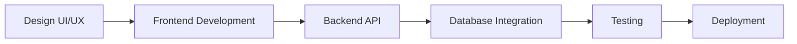

# 🌌 Ultimate Professional GitHub README

<div align="center">


<br>


<br><br>


</div>

---

# 👨‍💻 About Me


### 🚀 Full-Stack & Mobile Developer

I specialize in designing and developing modern digital products with a focus on:

* ⚡ High-performance web applications
* 📱 Native Android applications
* 🎨 Modern UI/UX systems
* 🔐 Secure backend architecture
* ☁️ Scalable server-side solutions
* 🧠 Clean and maintainable codebases

---

### 🌱 Current Focus

* Advanced System Design
* Clean Architecture
* Kotlin Multiplatform
* Docker & DevOps
* Microservices
* Cloud Infrastructure

<br clear="right"/>

---

# 🌐 Connect With Me

<div align="center">

<a href="mailto:chanraksmey1144@gmail.com">

</a>

<a href="https://linkedin.com/in/chanraksmey1144">

</a>

<a href="https://github.com/chanraksmey1144">

</a>

</div>

---

# 🛠️ Technology Stack

<div align="center">

## 🎨 Frontend Technologies


---

## ⚙️ Backend Technologies


---

## 📱 Mobile Development


---

## 🧰 Development Tools


</div>

---

# 🧠 Engineering Skills

```yaml
Frontend:
  - React.js
  - Next.js
  - Vue.js
  - Tailwind CSS
  - Responsive UI Design

Backend:
  - Laravel REST APIs
  - Express.js APIs
  - Authentication Systems
  - Database Architecture
  - CRUD Systems

Mobile:
  - Jetpack Compose
  - Material Design 3
  - Android UI/UX
  - Firebase Integration

Database:
  - MySQL
  - PostgreSQL
  - MongoDB

DevOps:
  - Docker
  - Git & GitHub
  - Deployment Workflows
```

---

# 🚀 Featured Projects

<div align="center">

<table>
<tr>
<td width="50%">

## ☕ E-Coffee Management System

### Full-Stack Coffee Shop Platform

#### 🔧 Tech Used

* Laravel API
* React.js
* Tailwind CSS
* MySQL
* JWT Authentication

#### ✨ Features

* Product Management
* Customer Dashboard
* Order Tracking
* Admin Analytics
* Inventory System
* Authentication & Roles

</td>

<td width="50%">

## 📱 Android Compose UI Showcase

### Modern Android UI Components

#### 🔧 Tech Used

* Kotlin
* Jetpack Compose
* Material 3
* Firebase

#### ✨ Features

* Navigation Drawer
* Full Screen Dialogs
* Date & Time Pickers
* Lazy Lists
* Carousel Components
* Animated UI Elements

</td>
</tr>
</table>

</div>

---

# 📈 GitHub Statistics

<div align="center">


</div>

---

# 🔥 Contribution Streak

<div align="center">


</div>

---

# 📊 Activity Graph

<div align="center">


</div>

---

# 🏆 GitHub Achievements

<div align="center">


</div>

---

# ⚡ Development Workflow



---

# 🎯 2026 Goals

* ✅ Build scalable SaaS applications
* ✅ Master advanced system design
* ✅ Learn cloud-native architecture
* ✅ Contribute to open source
* ✅ Build production-ready Android apps
* ✅ Improve DevOps workflow

---

# 💭 Developer Philosophy

<div align="center">

> "Code is not only about functionality — it is about creating experiences, solving problems, and building systems that scale beautifully."

</div>

---

# 🐍 Contribution Snake Animation

<div align="center">


</div>

---

# ☕ Support My Work

<div align="center">

<a href="https://github.com/sponsors">

</a>

</div>

---

<div align="center">

## ⭐ Thanks for visiting my profile!


</div>
